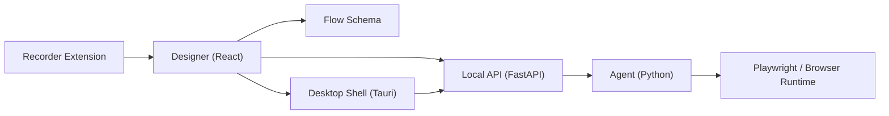

# RPA Flow V2

[English](./README.md) | [中文说明](./README_ZH.md)

[](https://github.com/Ethan-iopasd/rpa-browser-extension/actions/workflows/v2-ci.yml)
[](./LICENSE)
[](https://github.com/Ethan-iopasd/rpa-browser-extension/stargazers)

Open-source RPA workspace for recording, designing, executing, and packaging browser automation flows.

The main codebase lives in [`v2`](./v2). This repository combines a browser recorder extension, a React flow designer, a Python execution agent, a FastAPI control plane, and a Tauri desktop shell.

## At A Glance

- Record browser actions with a Chrome extension and send them back into the designer.
- Build flows visually with a React-based canvas and shared schema.
- Execute flows through a Python agent with Playwright-based browser automation.
- Run the local control plane with FastAPI.
- Package the full stack into a Windows desktop app with a Python sidecar.
- Use a native desktop picker for page element selection without requiring the extension.

## Status

- Experimental V2 workspace
- Windows-first developer experience
- Primary long-form docs are currently in Chinese
- Best suited for exploration, internal tooling, and further modernization


## Architecture



## Repository Layout

| Path | Role |
| --- | --- |
| `v2/apps/designer` | React flow designer UI |
| `v2/apps/agent` | Python execution agent |
| `v2/apps/recorder-extension` | Browser recorder extension |
| `v2/apps/desktop` | Tauri desktop shell |
| `v2/services/api` | FastAPI local control plane |
| `v2/packages/flow-schema` | Shared DSL schema and generated types |
| `v2/docs` | Product, architecture, and release docs |
| `v2/tests` | Python baseline and contract tests |

## Quick Start

### 1. Install dependencies

```powershell
cd v2
pnpm install

uv python install 3.10
uv venv --python 3.10 .venv
.\.venv\Scripts\Activate.ps1
uv pip install -e ".\services\api[dev]" -e ".\apps\agent[dev]"
python -m playwright install chromium
```

### 2. Start the local API

```powershell
cd v2\services\api
uvicorn app.main:app --reload --reload-dir app --port 8000
```

### 3. Start the designer

```powershell
cd v2
pnpm --filter @rpa/designer dev
```

### 4. Optional: run the agent smoke flow

```powershell
cd v2\apps\agent
rpa-agent --flow ..\..\packages\flow-schema\examples\minimal.flow.json
```

## Packaging And Releases

For source users and maintainers, start here:

- [`v2/docs/GITHUB_RELEASE_GUIDE.md`](./v2/docs/GITHUB_RELEASE_GUIDE.md) - recommended open-source release flow
- [`v2/scripts/release/README.md`](./v2/scripts/release/README.md) - build commands and artifact locations
- [`v2/docs/DESKTOP_RELEASE_CHECKLIST_ZH.md`](./v2/docs/DESKTOP_RELEASE_CHECKLIST_ZH.md) - desktop release checklist

Typical desktop build commands:

```powershell
cd v2
pnpm release:desktop:sidecar
pnpm release:desktop
```

Release artifacts are generated under `v2/dist/desktop/<version>/`.

## Documentation Map

- [`v2/README.md`](./v2/README.md) - workspace overview and detailed developer commands
- [`v2/docs/LOCAL_BOOTSTRAP.md`](./v2/docs/LOCAL_BOOTSTRAP.md) - local environment bootstrap
- [`v2/docs/DESKTOP_SIDECAR_PACKAGING_ZH.md`](./v2/docs/DESKTOP_SIDECAR_PACKAGING_ZH.md) - desktop sidecar packaging notes
- [`v2/docs/NATIVE_DESKTOP_PICKER_IMPLEMENTATION_ZH.md`](./v2/docs/NATIVE_DESKTOP_PICKER_IMPLEMENTATION_ZH.md) - native picker implementation details
- [`v2/docs/IFRAME_PICKER_OPEN_SOURCE_BENCHMARK_ZH.md`](./v2/docs/IFRAME_PICKER_OPEN_SOURCE_BENCHMARK_ZH.md) - iframe picker benchmark notes

## Documentation Language

Most deep-dive product and engineering documents in this repository are currently written in Chinese. If you want the most complete implementation notes, start with [`v2/README.md`](./v2/README.md) and the documents under [`v2/docs`](./v2/docs).

## License

[MIT](./LICENSE)
