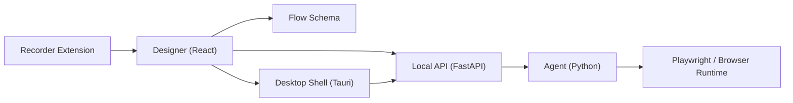

# RPA Flow V2

[English](./README.md) | [Chinese](./README_ZH.md)

[](https://github.com/Ethan-iopasd/rpa-browser-extension/actions/workflows/v2-ci.yml)
[](./LICENSE)
[](https://github.com/Ethan-iopasd/rpa-browser-extension/stargazers)

Open-source, Windows-first local browser automation workspace for recording, designing, executing, and packaging browser flows.

The main codebase lives in [`v2`](./v2). This repository combines a browser recorder extension, a React flow designer, a Python execution agent, a FastAPI control plane, and a Tauri desktop shell. The first public desktop release target is `v0.1.0-beta.1` as a GitHub pre-release.

## At A Glance

- Record browser actions with a Chrome extension and send them back into the designer.
- Build flows visually with a React-based canvas and shared schema.
- Execute flows through a Python agent with Playwright-based browser automation.
- Run the local control plane with FastAPI.
- Package the full stack into a Windows desktop app with a Python sidecar.
- Use a native desktop picker for page element selection without requiring the extension.

## Status

- Experimental V2 workspace
- Experimental beta release
- Windows-first desktop experience
- Best suited for exploration, internal tooling, and browser automation validation
- Recommended entry point: install the desktop app first; load the recorder extension only if you need recording


## Architecture



## Repository Layout

| Path | Role |
| --- | --- |
| `v2/apps/designer` | React flow designer UI |
| `v2/apps/agent` | Python execution agent |
| `v2/apps/recorder-extension` | Browser recorder extension |
| `v2/apps/desktop` | Tauri desktop shell |
| `v2/services/api` | FastAPI local control plane |
| `v2/packages/flow-schema` | Shared DSL schema and generated types |
| `v2/tests` | Python baseline and contract tests |
| `v2/scripts` | Build, release, and utility scripts |

## Local Startup

If you want the fastest first-run experience, start from the GitHub desktop installer pre-release. Source setup below is best for development and debugging.

### 1. Install dependencies

```powershell
cd v2
pnpm install

uv python install 3.10
uv venv --python 3.10 .venv
.\.venv\Scripts\Activate.ps1
uv pip install -e ".\services\api[dev]" -e ".\apps\agent[dev]"
python -m playwright install chromium
```

### 2. Start the local API

```powershell
cd v2\services\api
uvicorn app.main:app --reload --reload-dir app --port 8000
```

### 3. Start the designer

```powershell
cd v2
pnpm --filter @rpa/designer dev
```

### 4. Optional: run the agent smoke flow

```powershell
cd v2\apps\agent
rpa-agent --flow ..\..\packages\flow-schema\examples\minimal.flow.json
```

### 5. Optional: load the recorder extension

1. Open `chrome://extensions/`
2. Enable developer mode
3. Load `v2/apps/recorder-extension` as an unpacked extension

The recorder extension is optional. The desktop build can still run local flows and the native picker without it.

## Desktop Build

### Standard desktop build

```powershell
cd v2
pnpm release:desktop:sidecar
pnpm release:desktop
```

### Fast build

```powershell
cd v2
pnpm release:desktop:fast
```

### Manifest-only refresh

```powershell
cd v2
pnpm release:desktop:manifest
```

### Output locations

- Installer bundle: `v2/dist/desktop/<version>/bundle`
- Release manifest: `v2/dist/desktop/<version>/desktop-release-manifest.json`
- Windows setup file: `v2/dist/desktop/<version>/bundle/nsis/RPA Flow Desktop_<version>_x64-setup.exe`

## Release Flow

### 1. Verify the workspace

```powershell
cd v2
pnpm verify
```

### 2. Build release artifacts

```powershell
cd v2
pnpm release:desktop:sidecar
pnpm release:desktop
pnpm pack:recorder-extension
```

### 3. Create and push a tag

```powershell
git checkout main
git pull --ff-only
git tag -a v0.1.0-beta.1 -m "v0.1.0-beta.1"
git push origin main --tags
```

### 4. Publish the GitHub pre-release

Use the notes in [`v2/releases/v0.1.0-beta.1.md`](./v2/releases/v0.1.0-beta.1.md) and upload these assets:

- `RPA Flow Desktop_0.1.0-beta.1_x64-setup.exe`
- `desktop-release-manifest.json`
- `recorder-extension-<timestamp>.zip`

Set the GitHub release as `pre-release` and do not mark it as the latest stable release.

Recommended tag style:

- Stable: `vX.Y.Z`
- Pre-release: `vX.Y.Z-beta.N`

## Workspace Guide

For the most complete workspace-level commands and module overview, read [`v2/README.md`](./v2/README.md).

## License

[MIT](./LICENSE)
