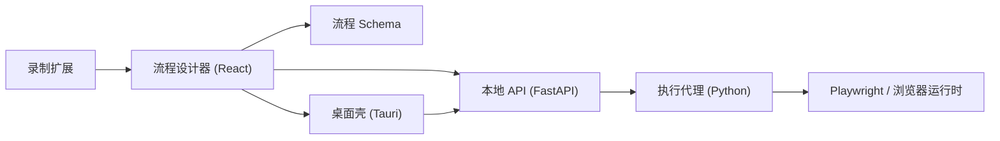

# RPA Flow V2

[English](./README.md) | [中文说明](./README_ZH.md)

[](https://github.com/Ethan-iopasd/rpa-browser-extension/actions/workflows/v2-ci.yml)
[](./LICENSE)
[](https://github.com/Ethan-iopasd/rpa-browser-extension/stargazers)

一个用于录制、设计、执行和打包浏览器自动化流程的开源 RPA 工作区。

主代码位于 [`v2`](./v2)。这个仓库并不只是单独的浏览器扩展，而是一套完整的本地自动化平台，包含浏览器录制扩展、React 流程设计器、Python 执行代理、FastAPI 控制面，以及 Tauri 桌面壳。

## 项目概览

- 用 Chrome 扩展录制网页操作，并回填到流程设计器。
- 用可视化画布编排自动化流程，并复用共享 Schema。
- 通过 Python Agent 和 Playwright 执行浏览器自动化。
- 用 FastAPI 提供本地控制面和运行接口。
- 将整套运行时打包成带 Python sidecar 的 Windows 桌面应用。
- 支持桌面原生页面拾取器，不依赖浏览器扩展也能选元素。

## 当前状态

- 这是一个实验性的 V2 工作区
- 当前开发体验以 Windows 为主
- 更深入的产品和工程文档大多仍是中文
- 适合继续演进、重构和二次开发


## 架构总览



## 仓库结构

| 路径 | 作用 |
| --- | --- |
| `v2/apps/designer` | React 流程设计器 UI |
| `v2/apps/agent` | Python 执行代理 |
| `v2/apps/recorder-extension` | 浏览器录制扩展 |
| `v2/apps/desktop` | Tauri 桌面端 |
| `v2/services/api` | FastAPI 本地控制面 |
| `v2/packages/flow-schema` | 共享 DSL Schema 与生成类型 |
| `v2/docs` | 产品、架构、发布相关文档 |
| `v2/tests` | Python 基线与契约测试 |

## 快速开始

### 1. 安装依赖

```powershell
cd v2
pnpm install

uv python install 3.10
uv venv --python 3.10 .venv
.\.venv\Scripts\Activate.ps1
uv pip install -e ".\services\api[dev]" -e ".\apps\agent[dev]"
python -m playwright install chromium
```

### 2. 启动本地 API

```powershell
cd v2\services\api
uvicorn app.main:app --reload --reload-dir app --port 8000
```

### 3. 启动设计器

```powershell
cd v2
pnpm --filter @rpa/designer dev
```

### 4. 可选：运行 Agent 冒烟流程

```powershell
cd v2\apps\agent
rpa-agent --flow ..\..\packages\flow-schema\examples\minimal.flow.json
```

## 打包与发布

面向开源使用者和维护者，建议先看这些文档：

- [`v2/docs/GITHUB_RELEASE_GUIDE.md`](./v2/docs/GITHUB_RELEASE_GUIDE.md) - GitHub Release 发布流程
- [`v2/scripts/release/README.md`](./v2/scripts/release/README.md) - 构建命令和产物位置
- [`v2/docs/DESKTOP_RELEASE_CHECKLIST_ZH.md`](./v2/docs/DESKTOP_RELEASE_CHECKLIST_ZH.md) - 桌面版发布检查清单

典型的桌面版构建命令：

```powershell
cd v2
pnpm release:desktop:sidecar
pnpm release:desktop
```

构建产物默认位于 `v2/dist/desktop/<version>/`。

## 文档导航

- [`v2/README.md`](./v2/README.md) - 工作区总说明和详细命令
- [`v2/docs/LOCAL_BOOTSTRAP.md`](./v2/docs/LOCAL_BOOTSTRAP.md) - 本地环境初始化
- [`v2/docs/DESKTOP_SIDECAR_PACKAGING_ZH.md`](./v2/docs/DESKTOP_SIDECAR_PACKAGING_ZH.md) - 桌面 sidecar 打包说明
- [`v2/docs/NATIVE_DESKTOP_PICKER_IMPLEMENTATION_ZH.md`](./v2/docs/NATIVE_DESKTOP_PICKER_IMPLEMENTATION_ZH.md) - 原生拾取器实现说明
- [`v2/docs/IFRAME_PICKER_OPEN_SOURCE_BENCHMARK_ZH.md`](./v2/docs/IFRAME_PICKER_OPEN_SOURCE_BENCHMARK_ZH.md) - iframe picker 基准分析

## 补充说明

如果你想快速理解这个项目，建议先看根目录英文首页，再深入阅读 [`v2/README.md`](./v2/README.md) 和 [`v2/docs`](./v2/docs) 下的文档。当前仓库的技术组合包括 React、FastAPI、Python、Playwright、Tauri 和浏览器扩展，整体上更像一套完整的 RPA 平台原型，而不是单一插件项目。

## 许可证

[MIT](./LICENSE)
