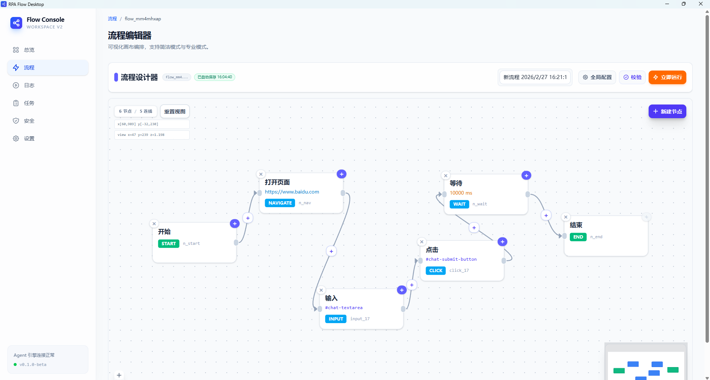
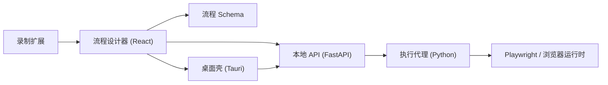

# RPA Flow V2

[English](./README.md) | [Chinese](./README_ZH.md)

[](https://github.com/Ethan-iopasd/rpa-browser-extension/actions/workflows/v2-ci.yml)
[](./LICENSE)
[](https://github.com/Ethan-iopasd/rpa-browser-extension/stargazers)

一个用于录制、设计、执行和打包浏览器自动化流程的开源 RPA 工作区。

主代码位于 [`v2`](./v2)。这个仓库并不只是单独的浏览器扩展，而是一套完整的本地自动化平台，包含浏览器录制扩展、React 流程设计器、Python 执行代理、FastAPI 控制面，以及 Tauri 桌面端。

## 项目概览

- 用 Chrome 扩展录制网页操作，并回填到设计器。
- 用可视化画布编排自动化流程，并复用共享 Schema。
- 通过 Python Agent 和 Playwright 执行浏览器自动化。
- 用 FastAPI 提供本地控制面和运行接口。
- 将整套运行时打包成带 Python sidecar 的 Windows 桌面应用。
- 支持桌面原生页面拾取器，不依赖浏览器扩展也能选元素。

## 当前状态

- 这是一个实验性的 V2 工作区
- 当前开发体验以 Windows 为主
- 适合继续演进、重构和二次开发



## 架构总览



## 仓库结构

| 路径 | 作用 |
| --- | --- |
| `v2/apps/designer` | React 流程设计器 UI |
| `v2/apps/agent` | Python 执行代理 |
| `v2/apps/recorder-extension` | 浏览器录制扩展 |
| `v2/apps/desktop` | Tauri 桌面端 |
| `v2/services/api` | FastAPI 本地控制面 |
| `v2/packages/flow-schema` | 共享 DSL Schema 与生成类型 |
| `v2/tests` | Python 基线与契约测试 |
| `v2/scripts` | 构建、发布和工具脚本 |

## 本地启动

### 1. 安装依赖

```powershell
cd v2
pnpm install

uv python install 3.10
uv venv --python 3.10 .venv
.\.venv\Scripts\Activate.ps1
uv pip install -e ".\services\api[dev]" -e ".\apps\agent[dev]"
python -m playwright install chromium
```

### 2. 启动本地 API

```powershell
cd v2\services\api
uvicorn app.main:app --reload --reload-dir app --port 8000
```

### 3. 启动设计器

```powershell
cd v2
pnpm --filter @rpa/designer dev
```

### 4. 可选：运行 Agent 冒烟流程

```powershell
cd v2\apps\agent
rpa-agent --flow ..\..\packages\flow-schema\examples\minimal.flow.json
```

### 5. 可选：加载录制扩展

1. 打开 `chrome://extensions/`
2. 开启开发者模式
3. 加载 `v2/apps/recorder-extension`

## 桌面打包

### 标准打包

```powershell
cd v2
pnpm release:desktop:sidecar
pnpm release:desktop
```

### 快速打包

```powershell
cd v2
pnpm release:desktop:fast
```

### 仅刷新发布清单

```powershell
cd v2
pnpm release:desktop:manifest
```

### 产物位置

- 安装包目录：`v2/dist/desktop/<version>/bundle`
- 发布清单：`v2/dist/desktop/<version>/desktop-release-manifest.json`
- Windows 安装包：`v2/dist/desktop/<version>/bundle/nsis/RPA Flow Desktop_<version>_x64-setup.exe`

## 发布流程

### 1. 执行校验

```powershell
cd v2
pnpm verify
```

### 2. 构建发布产物

```powershell
cd v2
pnpm release:desktop:sidecar
pnpm release:desktop
```

### 3. 创建并推送标签

```powershell
git checkout main
git pull --ff-only
git tag -a v0.1.0 -m "v0.1.0"
git push origin main --tags
```

### 4. 发布 GitHub Release

至少上传这两个文件：

- `RPA Flow Desktop_<version>_x64-setup.exe`
- `desktop-release-manifest.json`

推荐标签格式：

- 正式版：`vX.Y.Z`
- 预发布：`vX.Y.Z-beta.N`

## 工作区入口

如果你想看更完整的模块说明和命令入口，直接阅读 [`v2/README.md`](./v2/README.md)。

## 许可证

[MIT](./LICENSE)
